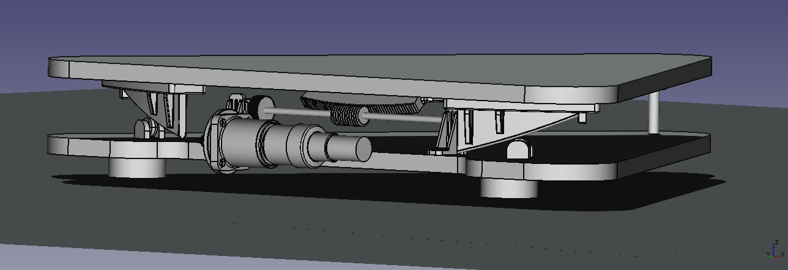
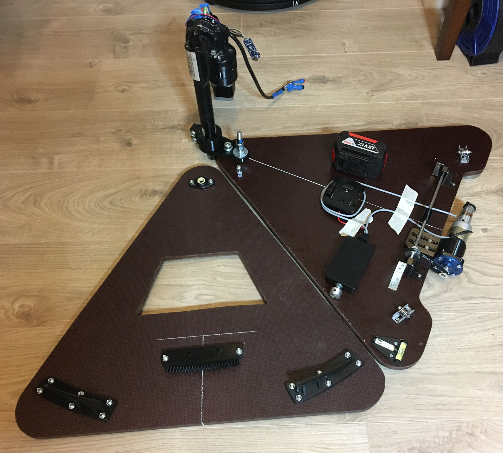
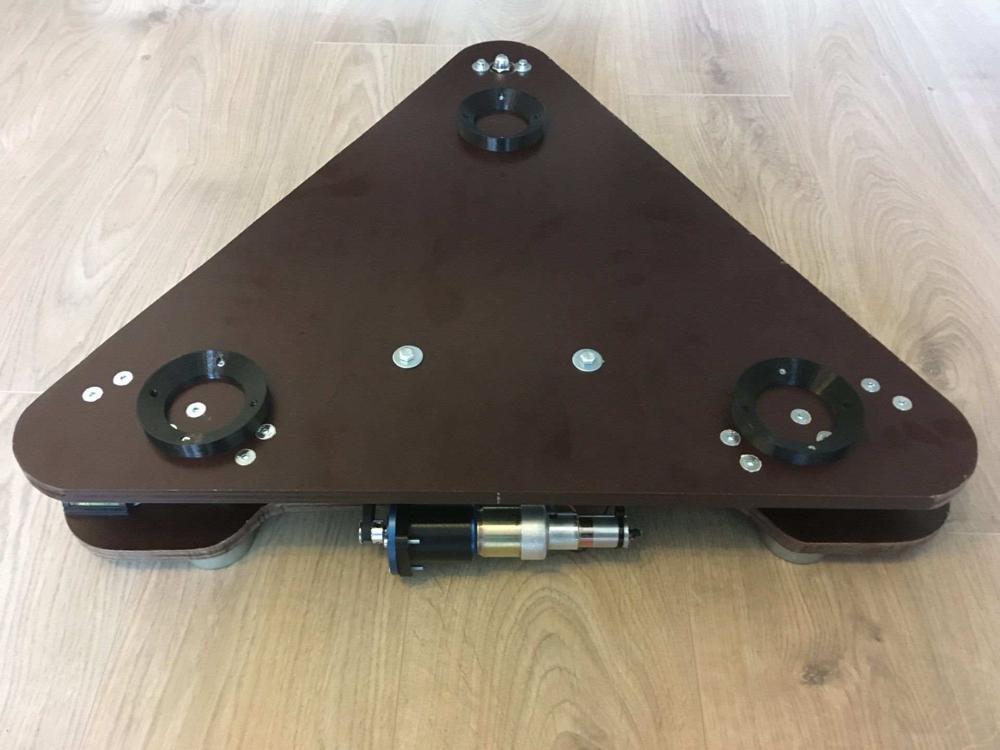

# EQ-Platform for a Dobsonian Telescope (Newton Telescope + Rocker Box) or a Camera Tripod
FreeCAD parametric drawings for an EQ-Platform. 
Enter your latitude and center of gravity of your teleskop in the spreadsheet and if you are in about 51° you get all the 3D parts to print and build this Platform.

* You need also about 12 to 15 mm polywood and some nuts and screws.
* For the south bearing you could use this: https://www.igus.de/product/382?artNr=EFSM-04
* For the gear you should order form RS a worm drive: https://de.rs-online.com/web/p/schnecken-und-ritzelgetriebe/5218559 and cut a 6 mm axel to the matching length.
* U-Profile roller bearing: https://www.kugellager-express.de/profillaufrolle-lfr50-5-4-2rs-5x16x8-mm

# License MIT

# FreeCAD Version
Because FreeCAD is free it's not that compatible between versions. If you have any problems with the saved models please try this version (Ubuntu 20):

FreeCAD-asm3-Daily-Conda-Py3-Qt5-20220111-glibc2.12-x86_64.AppImage
or upper...
